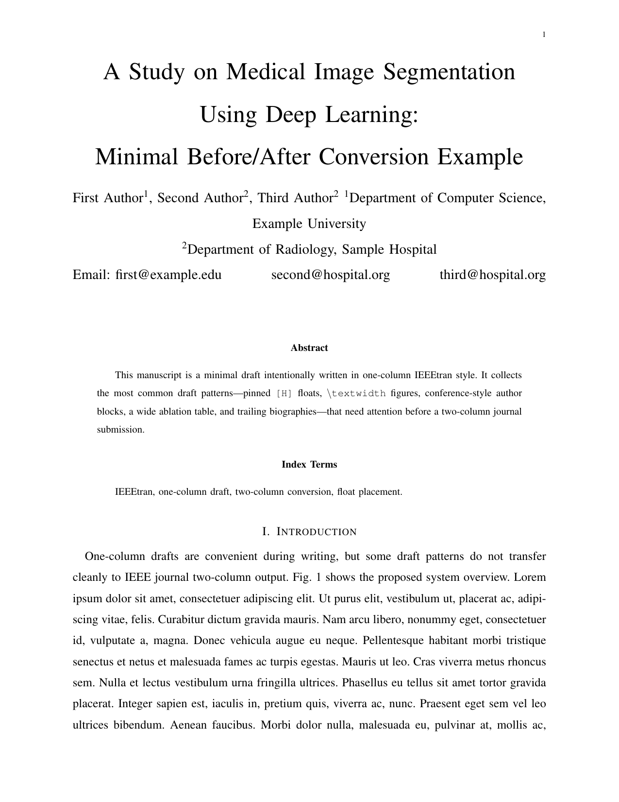
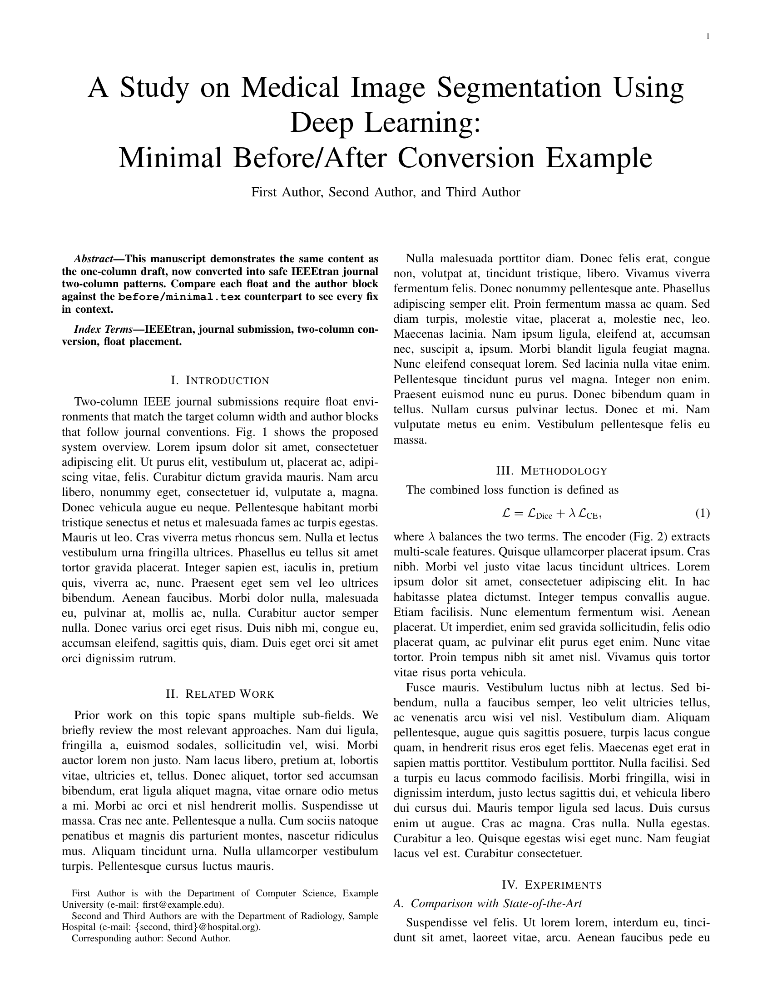
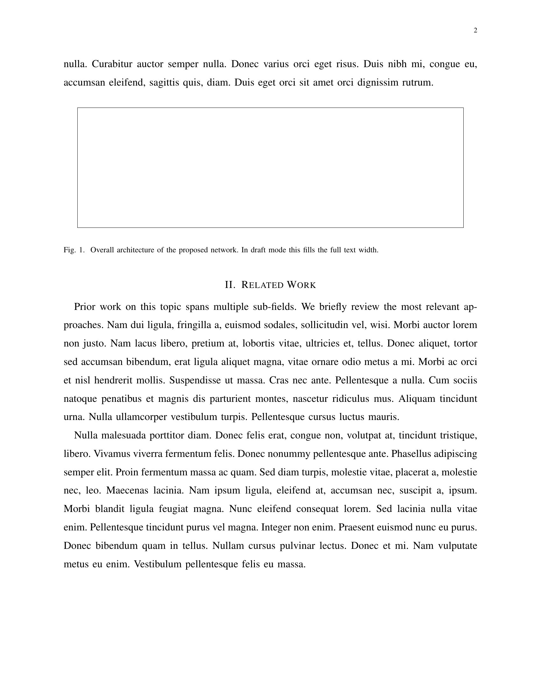
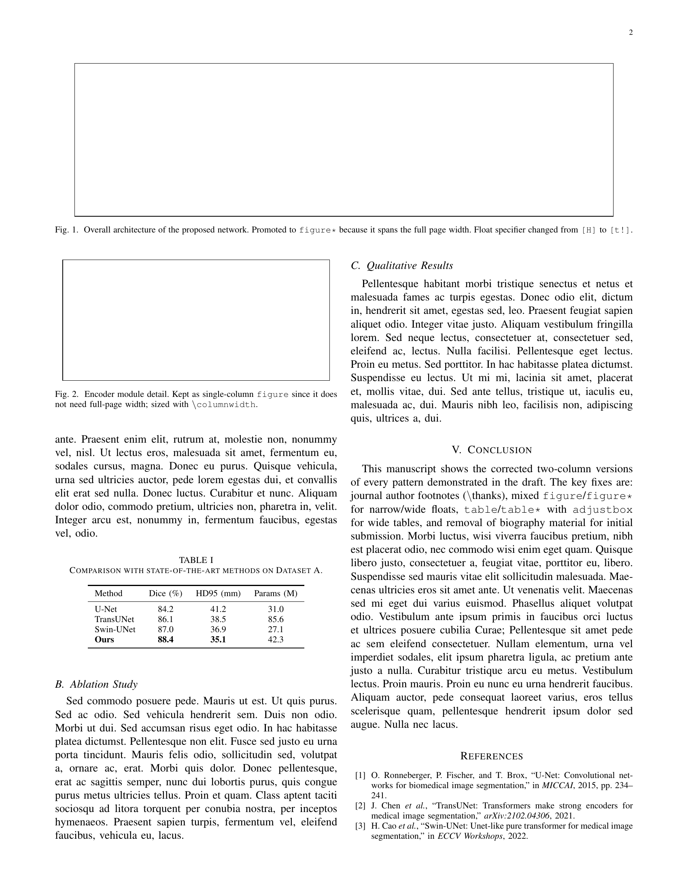

# IEEE Paper Doctor

[](LICENSE)
[](https://github.com/XiaojuCH/ieee-journal-single-to-double/stargazers)
[](https://github.com/XiaojuCH/ieee-journal-single-to-double/actions/workflows/compile.yml)

**English** | **[中文说明](README_ZH.md)**

Safely convert an IEEEtran one-column draft into a two-column journal manuscript—with a reviewable diff, deterministic checks, and compile evidence. Scientific content stays untouched.

Changing `onecolumn` to `twocolumn` is one line. Fixing the author block, wide figures, pinned tables, float queues, and bibliography page is not. IEEE Paper Doctor combines a Codex skill with a dependency-free CLI so the mechanical changes are reproducible and the judgment calls stay reviewable.

## Start in 30 seconds

Install the CLI directly from GitHub:

```bash
pipx install git+https://github.com/XiaojuCH/ieee-journal-single-to-double.git
```

Audit a manuscript without changing it:

```bash
ieee-paper-doctor check path/to/main.tex --strict
```

Preview conservative fixes as a unified diff:

```bash
ieee-paper-doctor fix path/to/main.tex
```

Write a separate converted source, then compile and verify it:

```bash
ieee-paper-doctor fix path/to/main.tex --output path/to/main.twocolumn.tex
ieee-paper-doctor verify path/to/main.twocolumn.tex --compile --strict
```

`fix` never overwrites the input unless you explicitly pass `--write`.

## Use as a Codex skill

Ask Codex to install the skill from this repository:

```text
$skill-installer Install ieee-paper-doctor from https://github.com/XiaojuCH/ieee-journal-single-to-double/tree/master/skills/ieee-paper-doctor
```

Then invoke it on a paper project:

```text
$ieee-paper-doctor Convert my IEEEtran draft to a two-column journal submission. Preserve scientific content, show me the diff, compile it, and report remaining layout risks.
```

The repository is also packaged as an installable Codex plugin through `.codex-plugin/plugin.json`.

## What it catches

- `draftcls`, `draftclsnofoot`, `onecolumn`, and conflicting class options in any order.
- Conference-style `\IEEEauthorblockN` / `\IEEEauthorblockA` in journal mode.
- `[H]` figures, tables, and algorithms that need placement review.
- `\textwidth` and overwide `1.x\textwidth` sizing inside one-column floats.
- Biographies and photo placeholders that may not belong in the current submission stage.
- Material left after the bibliography.
- Compile failures, oversized floats, overfull vertical boxes, and undefined references.

Use `--json` for machine-readable diagnostics and `--strict` to make warnings fail CI.

## What it fixes automatically

The CLI deliberately limits automatic edits to transformations that are easy to review:

- normalize IEEEtran journal class options for explicit two-column output;
- replace obvious `\textwidth` sizing inside unstarred floats with `\columnwidth`;
- preserve all scientific prose, equations, captions, labels, citations, and results;
- produce an idempotent diff before any write.

Choosing `figure` versus `figure*`, rebuilding author affiliations, removing biographies, and adding float packages remain skill-guided decisions because they depend on the paper and target journal.

## Before and after

| One-column draft | Corrected two-column manuscript |
|:---:|:---:|
|  |  |
|  |  |

The complete, self-contained examples live in [`examples/before`](examples/before) and [`examples/after`](examples/after).

## Scope and safety

IEEE Paper Doctor targets IEEEtran LaTeX journal manuscripts. It does not convert Word files or ACM, Springer, Elsevier, or arbitrary LaTeX templates.

Journal requirements override this tool. Before judgment-based edits, confirm the publication and whether the manuscript is an initial, revision, or final submission. The skill points to IEEE's Template Selector, LaTeX Analyzer, and PDF Checker for final validation.

## Development

```bash
python -m unittest discover -s tests -v
python skills/ieee-paper-doctor/scripts/ieee_paper_doctor.py check examples/after/minimal.tex --strict
```

The GitHub workflow runs unit tests, verifies that the bad fixture fails, verifies that the corrected fixture passes, and compiles both LaTeX examples.

Contributions are welcome—especially minimal reproducible IEEEtran failures and anonymized real-world conversion cases. See [CONTRIBUTING.md](CONTRIBUTING.md).

If IEEE Paper Doctor saves you a formatting round-trip, a star helps the next author find it.
