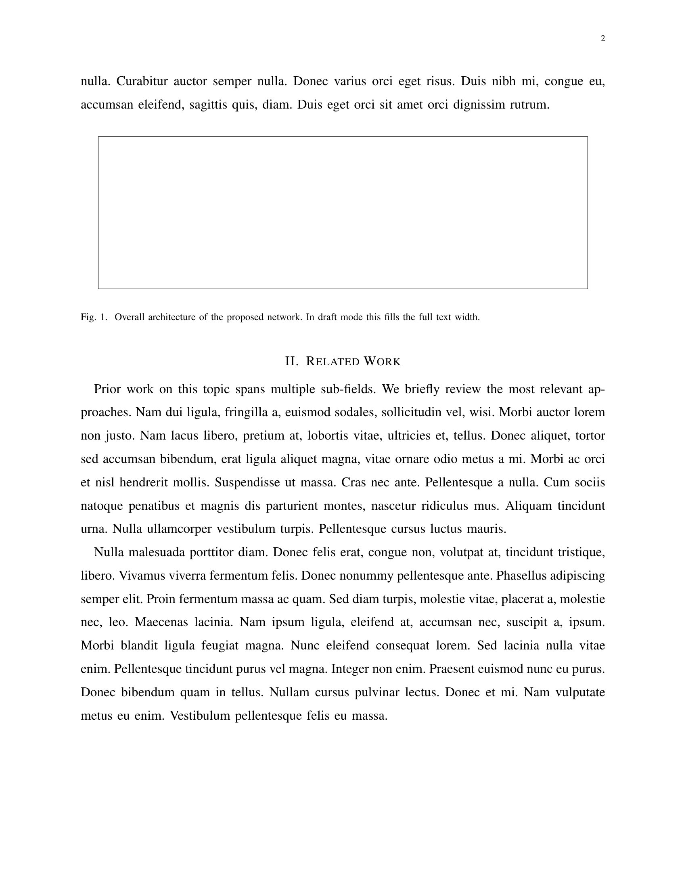
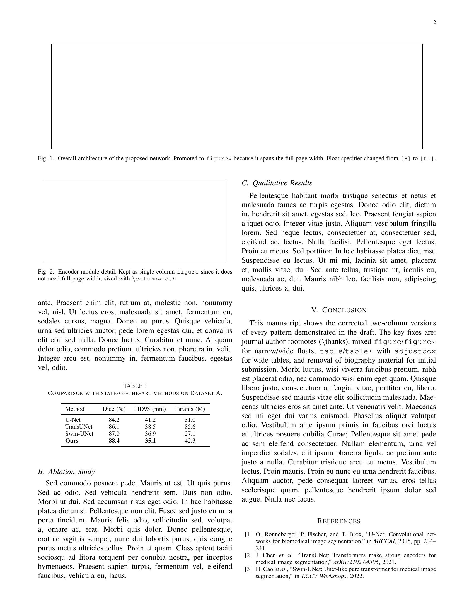

# ieee-journal-single-to-double

[](LICENSE)
[](https://github.com/XiaojuCH/ieee-journal-single-to-double/stargazers)
[](https://github.com/XiaojuCH/ieee-journal-single-to-double/actions/workflows/compile.yml)

**[中文说明]** | **[English](README.md)**

IEEEtran 单栏草稿转双栏，理论上改一行 `\documentclass` 就够了。实际上每次都会踩坑：会议式作者块放进 journal 模式悄悄报错、`[H]` 钉死的浮动体在双栏里溢出、`\textwidth` 的图超出单栏宽度、投稿版本还留着不该有的作者简介……每个坑都要单独搜一遍才能找到答案。这个仓库是我踩完这些坑之后，整理出来的对照手册。

## 转换前后对比

### 第1页 — 作者块格式

| 草稿 | 投稿版 |
|:---:|:---:|
|  |  |
| 会议式 `\IEEEauthorblockN/A` | 期刊式 `\author{...\thanks{...}}` 脚注 |

### 第2页 — 浮动体排版

| 草稿 | 投稿版 |
|:---:|:---:|
|  |  |
| `figure[H]` + `\textwidth` 占满单栏 | `figure*[t!]` 跨双栏；`figure` + `\columnwidth` 留在单栏 |

## ⚡ 用 AI 助手？

把下面这句话发给 Codex、Kiro、Cursor 或任何 AI 助手，它会自动克隆仓库、读取工作流并开始帮你转换：

```
使用 https://github.com/XiaojuCH/ieee-journal-single-to-double 里的 Codex 技能：克隆仓库，读取 SKILL.md，然后帮我把 IEEEtran 单栏草稿转为双栏期刊投稿格式。先让我提供 .tex 文件路径或直接运行审计脚本。
```

## 需要改什么

| 草稿写法 | 投稿写法 |
| --- | --- |
| `\documentclass[journal,12pt,draftclsnofoot,onecolumn]{IEEEtran}` | `\documentclass[journal,twocolumn]{IEEEtran}` |
| `\IEEEauthorblockN` / `\IEEEauthorblockA` | `\author{...\thanks{...}}` 脚注式作者块 |
| `\begin{figure}[H]`，图宽 `\textwidth` | 单栏用 `figure` + `\columnwidth`；跨栏用 `figure*` + `\textwidth` |
| `\begin{table}[H]`，表格手动拉宽 | 浮动 `table` / `table*`，配合 `adjustbox` |
| 参考文献后的作者简介 | 初投阶段直接删掉 |

## 怎么用

先对你的 `.tex` 文件跑一遍审计脚本：

```powershell
# Windows
powershell -ExecutionPolicy Bypass -File scripts\audit_ieee_twocolumn.ps1 -TexFile path\to\paper.tex
```

```bash
# Linux / macOS
bash scripts/audit_ieee_twocolumn.sh path/to/paper.tex
```

按提示修改，编译，目视检查 PDF 里的跨栏图和参考文献页，投稿。

## 文件说明

```
SKILL.md                                  AI 助手技能（Codex、Kiro 等）
examples/before/minimal.tex              含常见转换陷阱的草稿示例
examples/after/minimal.tex               修正后的双栏投稿版本
references/ieee-conversion-patterns.md   完整的 before/after 转换规则
references/official-sources.md           IEEE 编辑规范、IEEEtran CTAN、sttools
scripts/audit_ieee_twocolumn.ps1         审计脚本（Windows）
scripts/audit_ieee_twocolumn.sh          审计脚本（Linux/macOS）
```

---

如果这帮你省了时间，给个 Star 帮助更多人找到它。