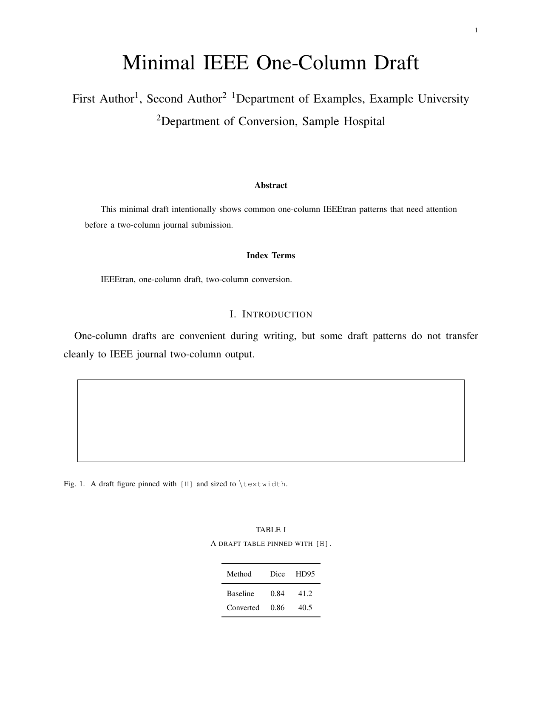
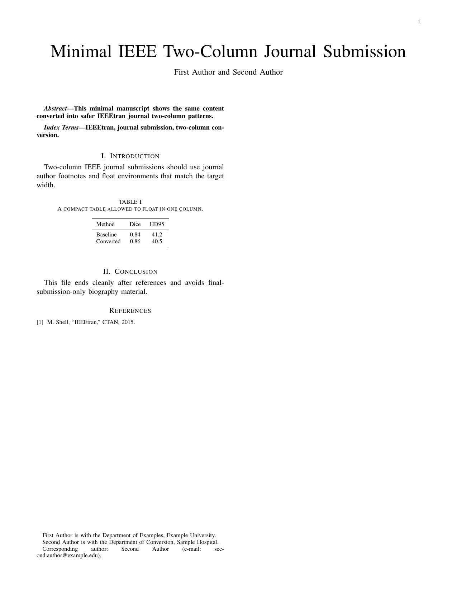

# IEEE期刊论文单栏转双栏指南

[](LICENSE)
[](https://github.com/XiaojuCH/ieee-journal-single-to-double/stargazers)
[](https://github.com/XiaojuCH/ieee-journal-single-to-double/actions/workflows/compile.yml)

**[中文说明]** | **[English](README.md)**

> 把 IEEEtran 单栏草稿转为双栏期刊投稿的实用指南——那些让你搜不到答案的坑，这里都有。

用 IEEEtran 单栏模式写草稿很舒服，但投稿双栏期刊时总会踩坑：会议式作者块放进 journal 模式不对、`[H]` 钉死的浮动体在双栏里跑飞、图宽 `\textwidth` 撑破单栏、参考文献后留着 biography 忘删……每个坑都要花时间才能搜到答案。这个仓库把规律、官方依据、最小可编译示例和审计脚本打包在一起，让你不用重新踩一遍所有坑。

## 📸 转换效果对比

| 单栏草稿 | 双栏期刊投稿 |
|:---:|:---:|
|  |  |
| `draftclsnofoot,onecolumn` | `journal,twocolumn` |

## 🔄 常见转换模式速查

| 单栏草稿的常见问题 | 双栏期刊的正确写法 |
| --- | --- |
| `\documentclass[journal,12pt,draftclsnofoot,onecolumn]{IEEEtran}` | `\documentclass[journal,twocolumn]{IEEEtran}` |
| 用会议式 `\IEEEauthorblockN` / `\IEEEauthorblockA` | 改用 `\author{...\thanks{...}}` 脚注式作者块 |
| `\begin{figure}[H]`，图宽 `\textwidth` | 单栏图用 `figure` + `\columnwidth`；跨栏图用 `figure*` + `\textwidth` |
| `\begin{table}[H]`，表格手动拉宽 | 用浮动 `table` / `table*`，配合 `adjustbox` 或字号调节 |
| 参考文献后有作者简介和头像占位符 | 初投阶段在 `\end{thebibliography}` 后直接 `\end{document}` |

## 🚀 快速上手

1. **复制技能** — 将 `SKILL.md` 放入你的 Codex 技能目录，或直接克隆本仓库作参考。
2. **审计你的稿件** — 在 Windows PowerShell 中运行：
   ```powershell
   powershell -ExecutionPolicy Bypass -File scripts\audit_ieee_twocolumn.ps1 -TexFile path\to\paper.tex
   ```
3. **修复问题** — 按提示修改，编译 PDF，目视检查跨栏图和参考文献页，然后投稿。

## 📂 仓库结构

```text
.
├─ SKILL.md                               # Codex 技能入口
├─ agents\openai.yaml                     # Codex UI 元数据（可选）
├─ assets\
│  ├─ before-page1.png                    # 单栏草稿预览图
│  └─ after-page1.png                     # 双栏期刊预览图
├─ examples\
│  ├─ before\minimal.tex                  # 含常见转换陷阱的草稿示例
│  └─ after\minimal.tex                   # 修正后的双栏版本
├─ references\
│  ├─ ieee-conversion-patterns.md         # 完整的 before/after 转换规则
│  └─ official-sources.md                 # IEEE/CTAN 官方依据
└─ scripts\
   └─ audit_ieee_twocolumn.ps1            # 结构审计脚本
```

## 📖 快速导航

| 文件 | 说明 |
|---|---|
| [SKILL.md](SKILL.md) | Codex 技能，直接在论文会话中调用 |
| [references/ieee-conversion-patterns.md](references/ieee-conversion-patterns.md) | 所有转换规律，含 before/after 代码块 |
| [references/official-sources.md](references/official-sources.md) | IEEE 编辑规范、IEEEtran CTAN 页、sttools 依据 |
| [examples/before/minimal.tex](examples/before/minimal.tex) | 最小可编译的单栏草稿示例 |
| [examples/after/minimal.tex](examples/after/minimal.tex) | 修正后的双栏期刊版本 |

## 为什么要做这个

大部分 IEEE 论文最初以单栏草稿形式写作，便于审阅和修改。真正的麻烦在投稿双栏版本时才来：浮动体排版、作者脚注规范、journal 模式下 IEEEtran 的行为——这些在"如何从单栏转双栏"这个具体路径上几乎没有文档。这个项目就是为这个缺口准备的。

---

⭐ 如果这帮你省了一个小时的排查时间，给个 Star 帮助更多人找到它。
